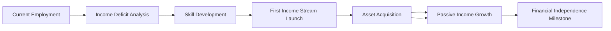

## Andy Tanner's 401(k) Take Control Framework

### Overview
A strategic methodology for breaking free from traditional retirement systems through proactive financial education, entrepreneurial income generation, and deliberate asset acquisition.

### Core Principles

#### 1. Solution-Centered Thinking
- Replace complaint vocabulary with action-oriented language
- Daily practice: Problem → 3 Solutions Rule
- Frameworks: [Problem Analysis Checklist] → [Solution Filter Matrix]

#### 2. Financial Education Mandate
- Continuous learning requirement (minimum 2 hours/week)
- Topics: Cash Flow Quadrant, Tax Optimization, Market Psychology
- Resources: "Rich Dad Poor Dad" series, "Cash Flow 101" modules

#### 3. Entrepreneurial Wealth Building
- Shift focus from employee to business owner/investor
- Target: Multiple income streams surpassing traditional salary
- Framework: Profit Equation Matrix
  ```mathematica
  Profit Model = (Skill × Audience ÷ Time) × Value + Scalability Factor
  ```

#### 4. Alternative Investment Strategy
- Move beyond stock markets to diversified asset classes
- Framework: Asset Allocation Pie Chart
  - 40% Real Estate
  - 30% Business Ventures
  - 20% Stocks/ETFs
  - 10% Precious Metals

### Implementation Roadmap

#### Phase One: Awareness (Weeks 1-4)
- Audit current retirement accounts
- Calculate projected retirement income vs. desired income
- Establish financial education baseline
- Create "Income Deficit Statement"

#### Phase Two: Skill Development (Weeks 5-12)
- Complete 3 advanced financial courses
- Develop first income stream prototype
- Build initial asset acquisition criteria checklist
- Implement reading schedule (1 book/week)

#### Phase Three: Execution (Months 4-12)
- Launch first business income stream
- Execute first real estate purchase
- Establish delegation protocols
- Initiate quarterly financial reviews

#### Phase Four: Optimization (Year 2+)
- Scale successful income streams
- Expand asset portfolio
- Develop exit strategies for traditional employment
- Implement succession planning

Regular optimization intervals at 6-month milestones.

### Financial Independence Timeline



### Related Frameworks
- [[Financial_Illiteracy_Strategy]] - Foundation
- [[Asset_Accumulation_Framework]] - Execution
- [[Entrepreneurial_Wealth_Blueprint]] - Scaling
- [[Robert_Kiyosaki_Mindset]] - Philosophy

## Implementation Checklist
- [ ] Complete current retirement audit
- [ ] Establish financial education routine
- [ ] Identify first income stream opportunity
- [ ] Research alternative investment vehicles
- [ ] Create asset acquisition criteria list
- [ ] Set quarterly financial review date
- [ ] Schedule delegation protocol research
- [ ] Set up financial dashboard tracking

## Success Metrics Timeline
| Timeframe | Metric |
|-----------|--------|
| Monthly | Active income growth rate |
| Quarterly | New asset acquisition |
| Annually | Passive income threshold reached |
| 3 Years | Financial independence benchmark |
| 5 Years | Multiple income streams established |