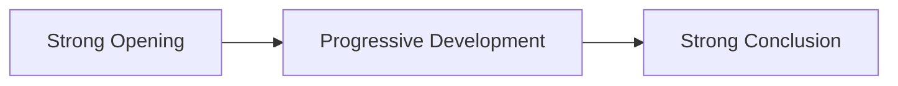

# Brian Tracy's 20-Step Author Framework

## Overview

A comprehensive system for writing and publishing a successful book, transforming ideas into published works through structured drafting, editing, and optimization processes.

## Core Principles

### 1. Start with Passion
- Choose a subject you genuinely care about
- Your belief in the message drives reader engagement
- "A person who cannot not write" - intrinsic motivation essential

### 2. Establish Expertise
- Deep knowledge required (10x vocabulary depth)
- Credibility built through experience and research
- Reader detects authenticity immediately

### 3. Know Your Audience
- Define specific target market
- Map hopes, fears, dreams, and frustrations
- Align book outcomes with reader desires

## The 20-Step Process

### Phase 1: Foundation (Steps 1-6)
1. **Define Core Message** - Passion-driven concept
2. **Validate Expertise** - Ensure depth of knowledge
3. **Define Target Market** - Specific audience identification
4. **Map Reader Psychology** - Hopes, fears, motivations
5. **Competitive Analysis** - 3-point differentiation strategy
6. **Research Gathering** - Collect 1500+ information pieces

### Phase 2: Structure (Steps 7-9)
7. **Chapter Organization** - 7-21 logical chapters
8. **Down-Dump Brainstorming** - All key points per chapter
9. **Mind Mapping** - Visual chapter planning

### Phase 3: Creation (Steps 10-11)
10. **Dictation Draft** - Structured first draft creation
11. **Typing Conversion** - Manuscript formatting

### Phase 4: Editing (Steps 12-18)
12. **Workspace Setup** - Dedicated editing environment
13. **First Edit** - Grammar and structure correction
14. **Second Edit** - Bite-sized heading insertion
15. **Front Matter** - Introduction, preface, acknowledgments
16. **Third Edit** - Quotes and action steps integration
17. **Fourth Edit** - Polish and content deletion
18. **Fifth Edit** - Line-by-line final review

### Phase 5: Completion (Steps 19-20)
19. **Time Investment** - 50-100 hours of focused work
20. **Environment Optimization** - Classical music for focus

## Chapter Structure Formula

Each chapter should:
- Start with high-value content
- Develop logically through the middle
- End with summary and emphasis

## Actionable Content Integration

### End-of-Chapter Elements
- **Quotes** - Inspirational or educational
- **Action Steps** - 2-7 concrete takeaways
- **Reflection Questions** - Reader engagement

## Implementation Timeline

| Phase | Duration | Key Deliverables |
|-------|----------|------------------|
| Foundation | 10-20 hours | Message, market, research |
| Structure | 5-10 hours | Chapters, mind maps |
| Creation | 20-40 hours | First draft |
| Editing | 20-40 hours | 5-edit process |
| Completion | 5-10 hours | Final polish |

## Success Metrics
- **Daily**: Hours written/edited
- **Weekly**: Chapters completed
- **Monthly**: Draft progress percentage
- **Completion**: Total project hours

## Related Frameworks
- [[Content_Strategy_Framework]] - For content planning
- [[Content_to_Payoff_Funnel_Framework]] - For monetization
- [[The_Content_Engine]] - For systematic creation
- [[The_Simple_7_Step_Autoresponder_Sequence]] - For email integration

## Implementation Checklist
- [ ] Define core message and passion
- [ ] Validate expertise credentials
- [ ] Create detailed target market profile
- [ ] Map reader psychology and desires
- [ ] Conduct competitive analysis
- [ ] Gather comprehensive research
- [ ] Structure chapters logically
- [ ] Execute brainstorming sessions
- [ ] Create mind maps
- [ ] Dictate first draft
- [ ] Set up editing workspace
- [ ] Complete 5-edit process
- [ ] Add front matter and action steps
- [ ] Schedule dedicated time blocks
- [ ] Optimize working environment