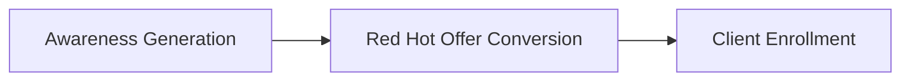

# Christian Mickelsen's Client Attraction Framework

## Overview

A 3-step system for converting leads into eager clients through strategically crafted free session offers that bypass traditional client resistance.

## Core Philosophy

### The Problem with Traditional Approaches
Most coaches say: "No-obligation coaching session"  
Result: People feel obligated to commit (psychological reactance)

### The Solution: Red Hot Offers
Instead: Create captivation, desire, and perceived value before the session  
Result: People "go bananas" wanting to work with you

## The Red Hot Free Session Offer Formula

### 3 Critical Elements

#### 1. Captivating Session Name
Create emotional hook + outcome promise:
- "Find Your Soul Mate Now Coaching Session" (Dating Coach)
- "Business Explosion Coaching Session" (Business Coach)
- "Finally Thin Forever Coaching Session" (Weight Loss Coach)

#### 2. Bulleted Benefit List
Structure 3 specific outcomes:
- Create crystal clear vision for desired outcome
- Uncover hidden challenges sabotaging success
- Leave renewed, reenergized, inspired to achieve

#### 3. Value/Scarcity Framing
Position as rare and valuable:
- "Special, very limited, totally FREE"
- "Limited availability - not guaranteed for all"
- "First come, first served basis"

## 3-Step Client Acquisition Process



### Step 1: Awareness Generation
- SEO optimization
- Social media presence
- Referral networks
- Speaking engagements

### Step 2: Red Hot Offer Conversion
- Email broadcasts
- Social media posts
- LinkedIn outreach
- Networking event offers

### Step 3: Client Enrollment
- Introductory session delivery
- Value gap creation
- Booking conversion strategy

## Ready-to-Use Templates

### Universal Template (No Specific Niche)
```
Subject Line: Secrets of Achievement & Change (Special Inside)...

Hi [NAME],

Do you have something you want to change or achieve?

#1: Get clear on what you want
#2: Get outside perspective
#3: Get support for goals

** Special ZERO COST "Rapid Change" Coaching Session **

=> Create crystal clear vision
=> Uncover hidden challenges
=> Leave renewed and inspired

Click reply to claim your session...
```

### Niche Templates Available For:
- Small Business Owners
- Sales Professionals
- Leaders/Executives
- Career Coaches
- Weight Loss Coaches
- Dating Coaches (Men/Women)
- Relationship Coaches (Couples)
- Parenting Coaches

## Multi-Channel Distribution

### Email List
- Copy template into broadcast
- Segment by niche for personalization

### Social Media
- Post in groups
- Share on personal profile
- LinkedIn outreach

### In-Person Events
- 30-second commercial format
- Business card collection method
- "Make sure I get your card" closing

## Success Stories

### Case Study: LinkedIn Client Generation
- Client went from $0 to $15,000/month in 60 days
- Method: Strategic LinkedIn outreach with Red Hot Offers
- Key: Template + Consistent posting + Reply handling

## Integration Points

### With Bill Baren's Enrollment Blueprint
- Use Red Hot Offers for pre-consultation credibility (Step 1)
- Align benefit lists with value gap creation (Step 4)

### With DigitalMarketer Systems
- Traffic Temperature for audience targeting
- Email Marketing Machine for nurture sequences

## Implementation Checklist
- [ ] Choose niche-specific template
- [ ] Customize benefit list for your audience
- [ ] Create scarcity framing language
- [ ] Set up email broadcast sequence
- [ ] Schedule social media posts
- [ ] Prepare networking commercial
- [ ] Create reply handling system
- [ ] Track conversion metrics

## Related Frameworks
- [[Bill_Baren_Enrollment_BluePrint]] - For session conversion
- [[The_Simple_7_Step_Autoresponder_Sequence]] - For email nurture
- [[Client_Attraction_Blueprint]] - For broader strategy
- [[Red_Hot_Session_Offer_Template]] - For template library